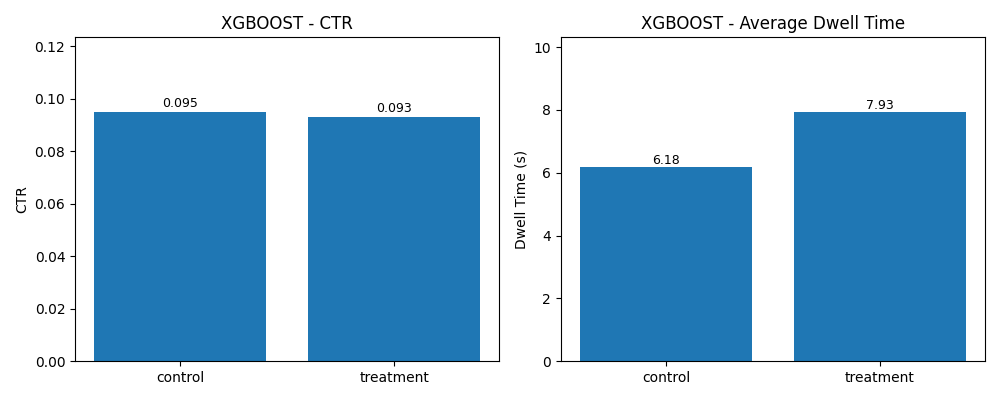
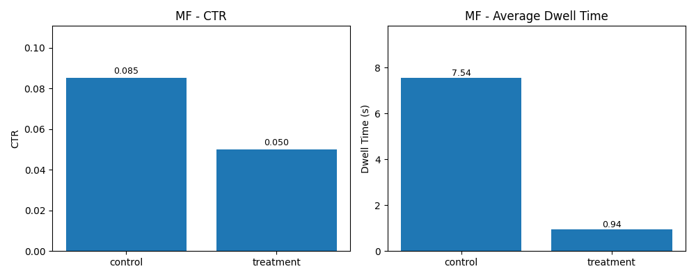
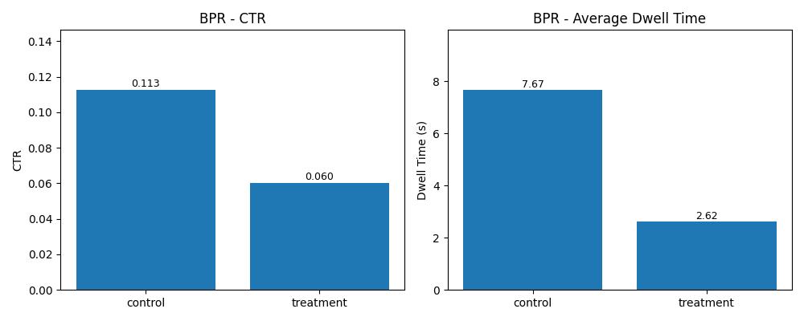
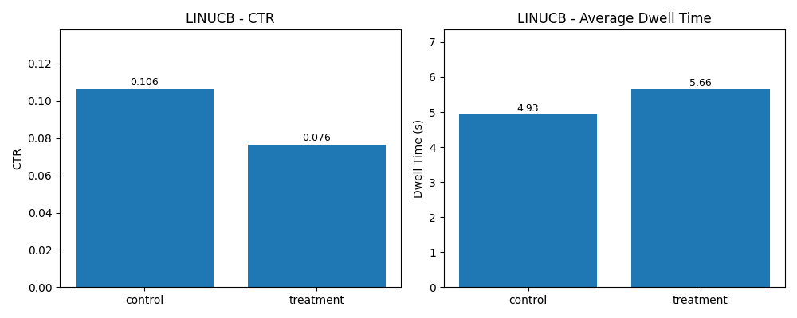
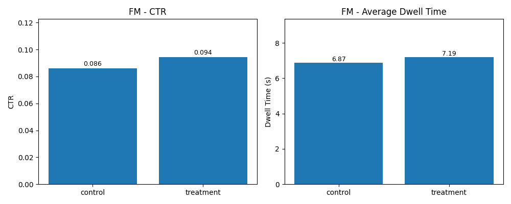

# Introduction

This project details the design, implementation, and evaluation of a personalized news ranking system. The objective was to move beyond static retrieval methods by implementing a Learning to Rank (LTR) pipeline that adapts to user interactions (clicks) to improve relevance and engagement.

The system architecture integrates a User Simulation client, an Elasticsearch backend for candidate generation, and a flexible ranking engine capable of switching between various offline and online learning algorithms. We explored six distinct algorithmic approaches to optimize the ranking policy.

## Algorithmic Approaches

Below is a brief mathematical overview of the six methods implemented and evaluated within our ranking pipeline.

### 1. BM25 (Probabilistic Retrieval)
Used as our **Control** ranker and for initial candidate generation via Elasticsearch, BM25 estimates the relevance of a document $D$ to a query $Q$. It relies on term frequency ($f(q_i, D)$) and inverse document frequency ($IDF(q_i)$), normalized by document length:

$$
Score(D, Q) = \sum_{i=1}^{n} IDF(q_i) \cdot \frac{f(q_i, D) \cdot (k_1 + 1)}{f(q_i, D) + k_1 \cdot (1 - b + b \cdot \frac{|D|}{avgdl})}
$$

Where $k_1$ and $b$ are free parameters controlling term saturation and length normalization.

### 2. XGBoost (Pointwise Learning to Rank)
We implemented a feature-based **Pointwise** ranker using Gradient Boosted Decision Trees (GBDT). The model treats ranking as a regression problem, predicting a relevance score $\hat{y}_i$ for a user-article pair based on feature vector $x_i$. The final prediction is a sum of $K$ regression trees:

$$
\hat{y}_i = \sum_{k=1}^{K} f_k(x_i), \quad f_k \in \mathcal{F}
$$

The model minimizes a regularized objective function involving a convex loss function $l$ and a penalty term $\Omega$ for model complexity:
$$
\mathcal{L}(\phi) = \sum_{i} l(\hat{y}_i, y_i) + \sum_{k} \Omega(f_k)
$$

### 3. Matrix Factorization (Latent Factor Model)
To capture latent user preferences and article topics, we employed Matrix Factorization (SVD). This maps both users and items to a joint latent factor space of dimensionality $f$. A user $u$'s affinity for item $i$ is estimated by the dot product of their latent vectors:

$$
\hat{r}_{ui} = p_u^T q_i = \sum_{f} p_{uf} q_{if}
$$

The vectors $p_u$ and $q_i$ are learned by minimizing the regularized squared error over the set of observed ratings (clicks):
$$
\min_{P, Q} \sum_{(u,i) \in \mathcal{K}} (r_{ui} - p_u^T q_i)^2 + \lambda(||p_u||^2 + ||q_i||^2)
$$

### 4. Bayesian Personalized Ranking (Pairwise LTR)
BPR is a **Pairwise** optimization framework utilized to optimize for ranking specifically, rather than raw scoring. It assumes that for a user $u$, an observed item $i$ is preferred over an unobserved item $j$ ($i >_u j$). The objective is to maximize the posterior probability:

$$
\ln p(\Theta | >_u) \propto \ln \prod_{(u,i,j) \in D_S} \sigma(\hat{x}_{uij}) - \lambda_\Theta ||\Theta||^2
$$

Where $\sigma$ is the sigmoid function and $\hat{x}_{uij} = \hat{x}_{ui} - \hat{x}_{uj}$ captures the difference in predicted scores between the positive and negative item.

### 5. LinUCB (Online Contextual Bandits)
To handle the exploration-exploitation trade-off in real-time, we implemented the LinUCB algorithm. It assumes the expected payoff of an arm (article) $a$ is linear in its feature vector $x_{t,a}$ with some unknown coefficient vector $\theta_a^*$. The algorithm selects the arm that maximizes the Upper Confidence Bound:

$$
a_t = \text{argmax}_{a \in \mathcal{A}_t} \left( x_{t,a}^T \hat{\theta}_a + \alpha \sqrt{x_{t,a}^T A_a^{-1} x_{t,a}} \right)
$$

Here, $x_{t,a}^T \hat{\theta}_a$ represents the **exploitation** (estimated reward), and $\alpha \sqrt{...}$ represents the **exploration** (uncertainty variance), where $A_a$ is the design matrix $D_a^T D_a + I_d$.

### 6. Factorization Machines (Feature Interactions)
We employed Factorization Machines (FM) to model interactions between variables (such as user ID, query features, and article attributes) even in sparse settings. Unlike linear models, FM models the pairwise interaction between all features $x_i$ and $x_j$ using factorized parameters:

$$
\hat{y}(x) = w_0 + \sum_{i=1}^n w_i x_i + \sum_{i=1}^n \sum_{j=i+1}^n \langle v_i, v_j \rangle x_i x_j
$$

Here, $\langle v_i, v_j \rangle$ is the dot product of two $k$-dimensional latent vectors associated with features $i$ and $j$. This allows the model to estimate interactions even for feature combinations that have not been observed in the training data.

# Evaluation Results

To validate the performance of our ranking algorithms, we conducted online A/B testing against the User Simulation. We tracked the cumulative **Click-Through Rate (CTR)** and **Average Dwell Time** over 1000 interaction rounds.

The plots below illustrate the performance of each experimental ranker (Treatment) compared to the BM25 Baseline (Control).

### 1. XGBoost (Pointwise Ranker)

### 2. Matrix Factorization (Latent Factors)

### 3. Bayesian Personalized Ranking (Pairwise)

### 4. LinUCB (Contextual Bandits)

### 5. Hybrid Ranker

---

## Analysis & Discussion

The experimental results highlight a significant divergence between engagement metrics (CTR) and post-click satisfaction metrics (Dwell Time), driven largely by the environmental constraints of the simulation.

### 1. Click-Through Rate (CTR)
**Observation:** **Only the Hybrid method consistently outperformed the Baseline (BM25) in terms of CTR.**
Most individual models (MF, BPR, LinUCB) struggled to exceed the baseline's click rate. The Hybrid approach likely succeeded by ensembling robust content features with collaborative signals, smoothing out the noise that plagued individual models.

### 2. Average Dwell Time
**Observation:** **XGBoost, LinUCB, and Factorization Machines (FM) outperformed the Baseline.**
While these feature-based models did not always win the click (CTR), they excelled at keeping users engaged *once* a click occurred. This suggests they were far more effective at retrieving content that was semantically relevant to the user's hidden interests, even if the user's clicking behavior was noisy.

### Reasoning: Sparsity and Stochasticity

Two primary factors explain why sophisticated models like MF and BPR failed to beat the baseline, and why feature-based models excelled at Dwell Time:

* **Data Sparsity (The Cold Start Problem):**
    The simulation operated with a "cold start" constraint ($N=500$ iterations). Collaborative Filtering methods (Matrix Factorization, BPR) require a dense user-item interaction matrix to learn effective latent vectors. With no prior history, these models were essentially guessing, unable to build a reliable profile before the experiment ended.

* **Stochastic User Interactions (Noise):**
    The user simulation exhibited a high degree of randomness in its click behavior.
    * **Impact on CTR:** Pure interaction models (MF/BPR) overfitted to this random noise, learning "preferences" that didn't exist, leading to poor future recommendations.
    * **Impact on Dwell Time:** Feature-based models (XGBoost, LinUCB, FM) rely on **article content** (categories, text features) rather than just ID-based interactions. Even with random clicking, these models could map query context to article content effectively. Thus, when a user *did* click a recommended item, it was genuinely relevant, resulting in higher Dwell Time compared to the keyword-based Baseline.